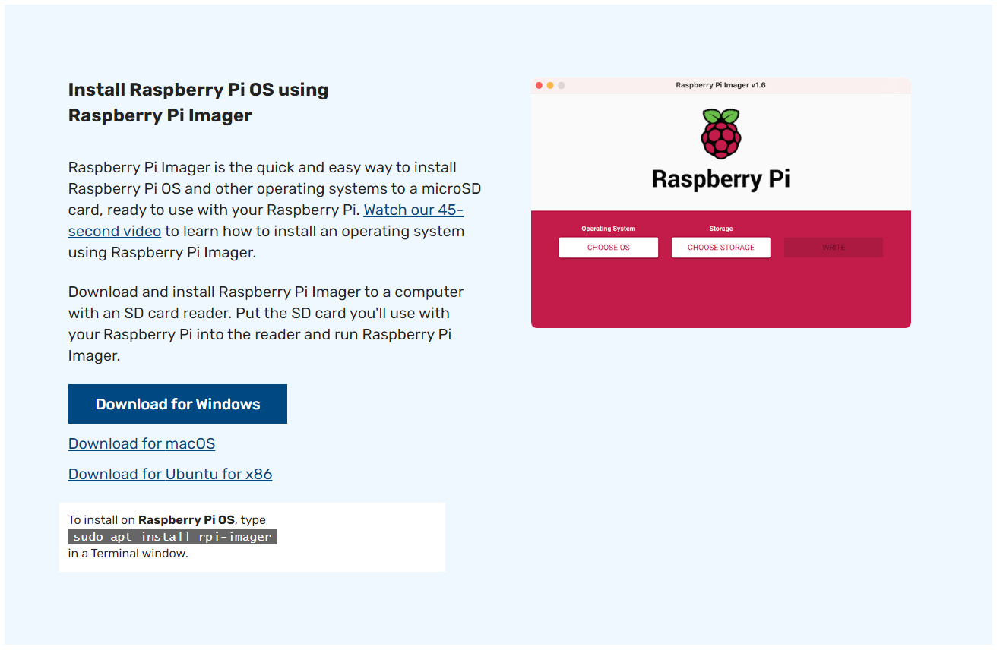
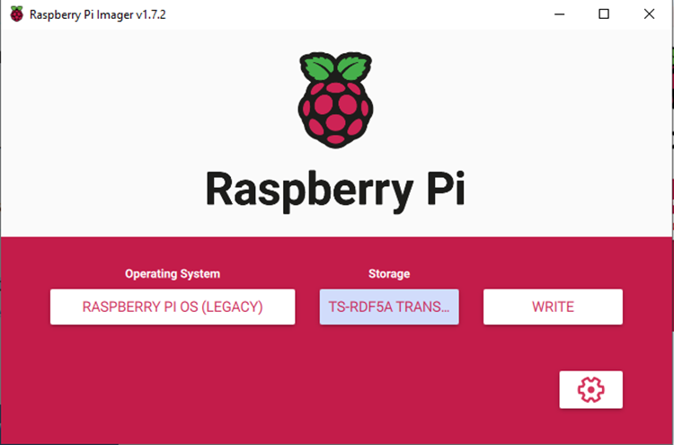
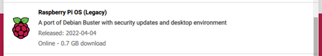
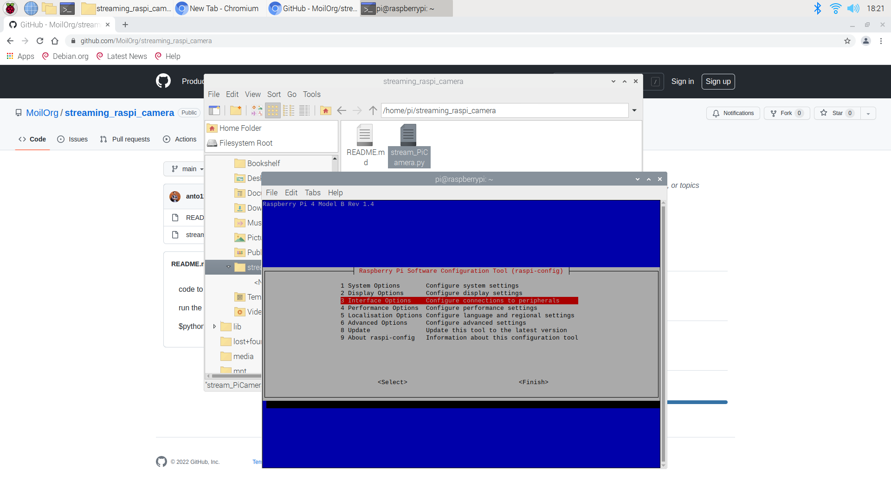
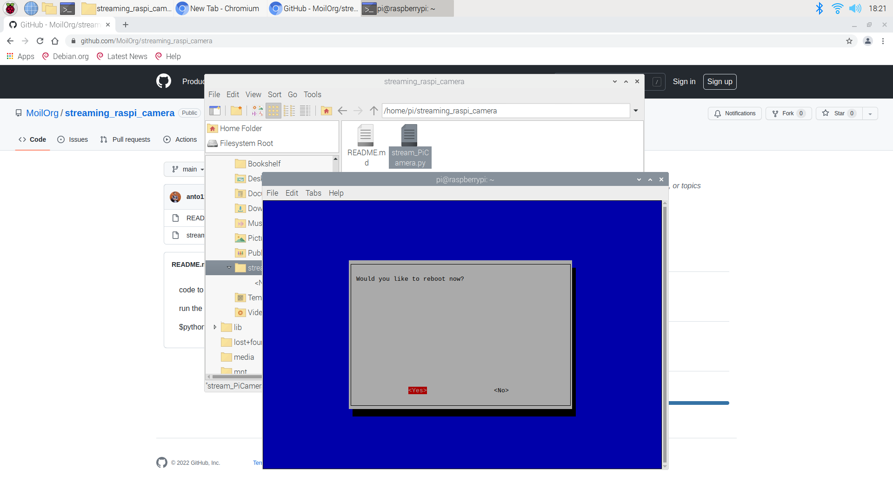
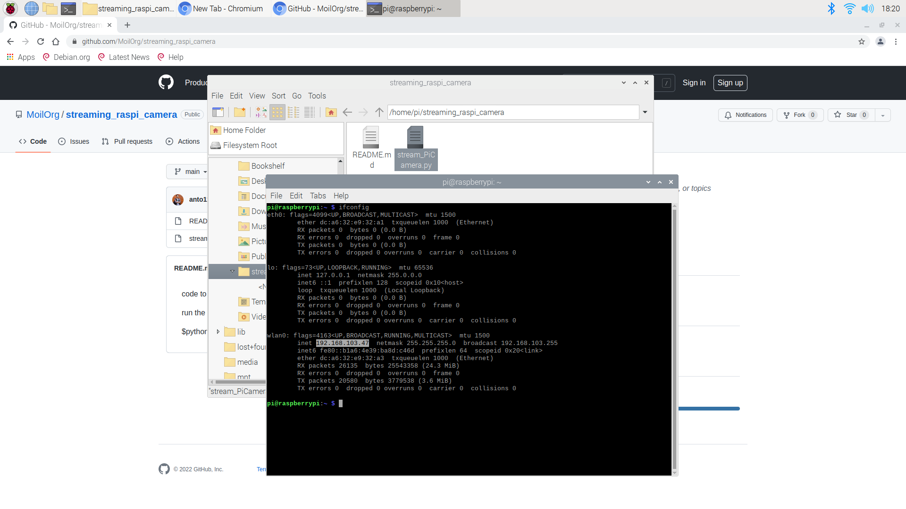
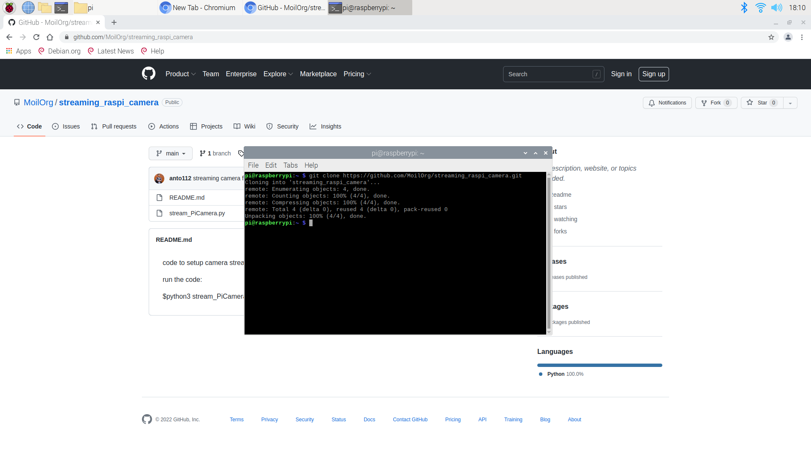
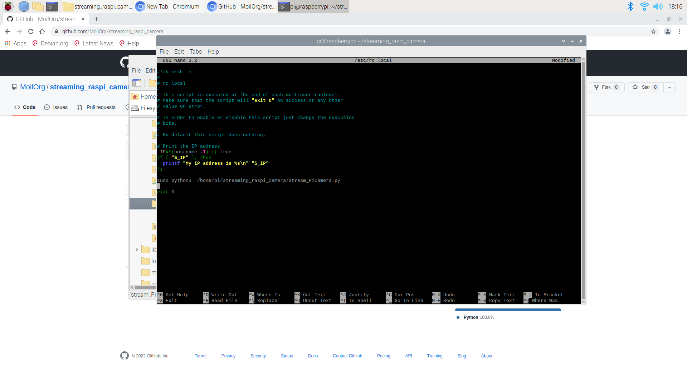
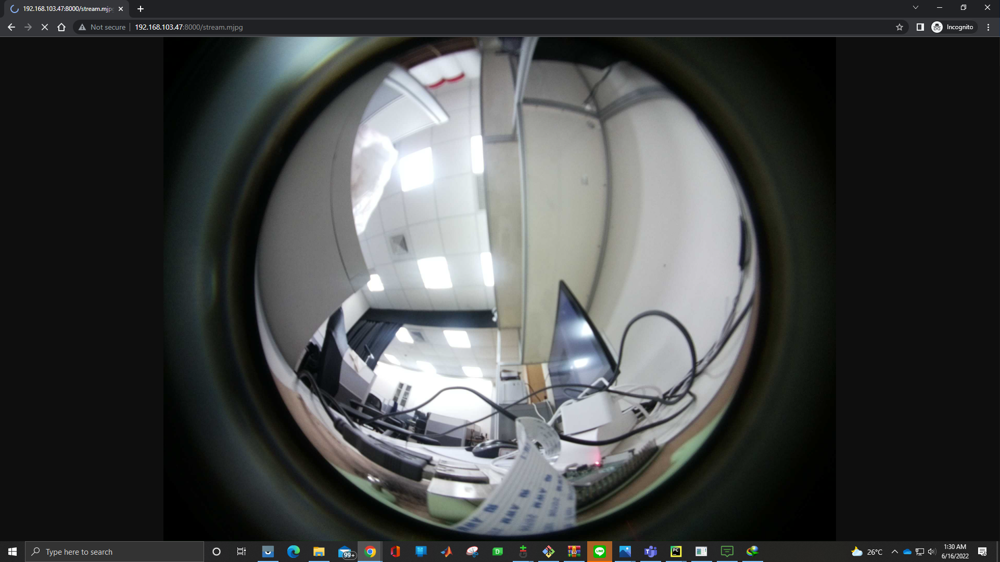

# Setup Raspberrypi for streaming camera
In this tutorial will guide how to make your raspberry pi streaming a video

### Requirement
For the tutorial we need this requirement

    1. Raspberry Pi, Camera, Power cabel and HDMI
    2. SD card and Card reader
    4. Monitor, keyboard and mouse
    5. Computer or labtop with internet access

### 1. Raspberry pi installation
1. To install Raspberry Pi OS we need [Raspberry Pi Imager](https://www.raspberrypi.com/software/). Download and install it in your computer



2. Connect your SD Card to the computer using card
    ```text
    make sure your sd card is empty
    ```
3. Open Raspberry Pi Imager, 
   ```text
   we must select what OS we want to use and select the storage (SD Card)
   ```



  - Select Operating System
    
   ```text
   - Select Operating System -> Raspberry Pi OS (other) -> Raspberry Pi OS (Legacy) 
   ```
   

   ```
   Note: We using Debian Buster OS
   ```
  - Select storage
   ```
   Select the SD card that we want to use
   ```

Next select **WRITE**, and wait until all process finish

### 2. Setup Raspberrypi
1. Connect SD card to Raspberry PI (raspi)
   ```text
   - plug SD card to raspberry pi 
   - connect raspi to monitor, keyboard and mouse
   - connect camera to raspi 
   ```
2. Turn on
   
   Turn on the raspberry pi and setup **password** and **internet connection**
   ```text
   - Add Password
   - Add Wifi internet access
   ```

3. Enable camera
   
   we need to enable the camera by open the configuration raspi using this command line

   ```commandline
   raspi-config
   ```
   We will see raspberry pi software configuration tool just like image bellow


   
   To enable the camera please follow this step

   ```
   select Interface Option -> Camera -> Yes -> Yes
   ```

---
```
Note: Raspberry Pi will reboot
```
4. IP Address Raspberry Pi
   
   To Access the camera we need IP Address of the raspi, to know that type this command
```text
ifconfig
```



The ip address of the raspberry pi was **192.168.103.47**

### 3. Get python code

open your terminal and type this command to download the python code
```commandline
git clone https://github.com/MoilOrg/streaming_raspi_camera.git 
```


### 5. run python code automatically when raspi booting

   If want to run the python code automatically without always type python3 stream_PiCamera.py on raspberry pi terminal, please follow this tutorial
1. Path of Code

   Please remember **path** of your python code (clone location)

2. Edit rc.local file
   
   we need to access **rc.local** file by type this command line in your Terminal

   ```commandline
   sudo nano /etc/rc.local
   ```
   After that, we can add one line code just like this
   ```commandline
   sudo python3 /home/pi/streaming_raspi_camera/stream_PiCamera.py
   ```
   Save the file



```
Note: we need to reboot the raspberry pi to finish the process
```

### 4. Streaming using other computer 
To access raspberry pi through network we need the ip address of the Raspberry Pi (tutorial number 2.4).

type this link to your browser
```text
http://Ip_address:8000/stream.mjpg
```


Example:
```html
http://192.168.103.47:8000/stream.mjpg
```

